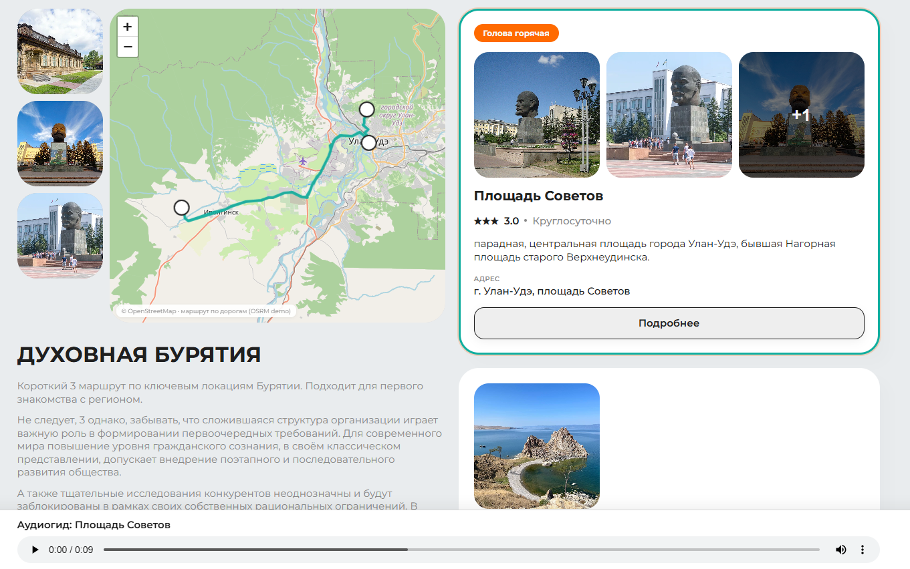
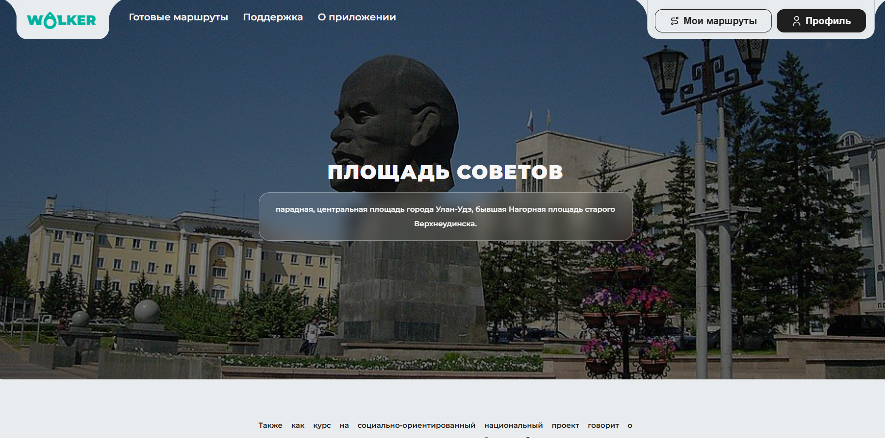
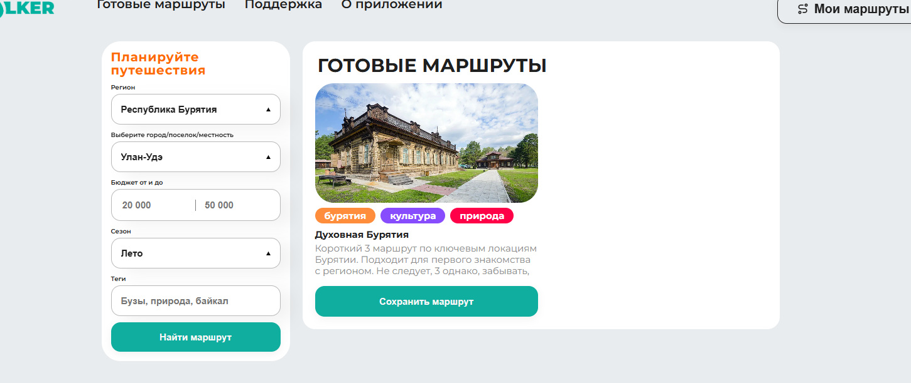

# Walker

Walker - веб-приложение для планирования туристических маршрутов по Байкальскому региону. Проект состоит из клиентского React-приложения, Strapi CMS и PostgreSQL.

Пользовательская часть показывает маршруты и точки интереса, а Strapi используется как админ-панель для управления контентом: маршрутами, локациями, изображениями и сохраненными маршрутами.

## Возможности

- просмотр туристических маршрутов и точек интереса;
- фильтрация и поиск маршрутов;
- страницы маршрутов и отдельных локаций;
- интерактивная карта на Leaflet;
- сохранение выбранных маршрутов;
- управление контентом через Strapi Admin Panel.

## Стек

- Frontend: React 19, React Router, Leaflet, CSS Modules;
- CMS/API: Strapi 5;
- Database: PostgreSQL 15 в Docker;
- Runtime: Node.js;
- Containers: Docker и Docker Compose.

Go в проекте сейчас не используется.

## Требования

Для запуска через Docker:

- Docker Desktop;
- Docker Compose v2;
- свободные порты `3000`, `1337`, `5432` внутри Docker-сети.

Для локального запуска без Docker:

- Node.js `20.x` или `22.x`;
- npm `>= 6`;
- PostgreSQL `15+`;
- отдельно настроенные `.env` файлы для `cms` и `client`.

Важно: в `cms/package.json` указано требование Node.js `>=20.0.0 <=24.x.x`. Если Strapi не собирается в Docker из-за версии Node, нужно использовать Node 20+ в `cms/Dockerfile`.

## Структура проекта

```text
walker-project/
  client/              # React-приложение
  cms/                 # Strapi CMS/API
  images/              # изображения для README
  docker-compose.yml   # запуск БД, CMS и клиента
  .env                 # локальные переменные окружения, не коммитить
  .env.example         # пример переменных окружения
```

## Переменные окружения

Создайте файл `.env` в корне проекта на основе `.env.example`:

```powershell
copy .env.example .env
```

Linux/macOS:

```bash
cp .env.example .env
```

Минимальный набор переменных:

```env
DB_CLIENT=postgres
DB_HOST=db
DB_NAME=walker_db
DB_USER=walker_admin
DB_PASSWORD=change_me
DB_PORT=5432

CORS_ORIGINS=http://localhost:3000,http://127.0.0.1:3000

STRAPI_PORT=1337
APP_KEYS=change_me_key_1,change_me_key_2
API_TOKEN_SALT=change_me_api_token_salt
ADMIN_JWT_SECRET=change_me_admin_jwt_secret
TRANSFER_TOKEN_SALT=change_me_transfer_token_salt
JWT_SECRET=change_me_jwt_secret
ENCRYPTION_KEY=change_me_encryption_key

REACT_APP_API_URL=http://localhost:1337
```

Назначение переменных:

- `DB_CLIENT` - тип базы данных для Strapi, в Docker используется `postgres`;
- `DB_HOST` - хост базы данных, для Docker Compose должен быть `db`;
- `DB_NAME` - имя базы данных PostgreSQL;
- `DB_USER` - пользователь PostgreSQL;
- `DB_PASSWORD` - пароль PostgreSQL;
- `DB_PORT` - порт PostgreSQL внутри Docker-сети;
- `CORS_ORIGINS` - разрешенные адреса фронтенда для запросов к CMS;
- `STRAPI_PORT` - порт Strapi;
- `APP_KEYS` - ключи приложения Strapi;
- `API_TOKEN_SALT` - salt для API-токенов Strapi;
- `ADMIN_JWT_SECRET` - секрет админской авторизации Strapi;
- `TRANSFER_TOKEN_SALT` - salt для transfer tokens Strapi;
- `JWT_SECRET` - секрет JWT;
- `ENCRYPTION_KEY` - ключ шифрования Strapi Admin;
- `REACT_APP_API_URL` - адрес API, который использует React-приложение.

## Установка

Клонируйте репозиторий:

```bash
git clone https://github.com/Aidajy111/Walker.git
cd Walker-project
```

Создайте `.env`:

```powershell
copy .env.example .env
```

При необходимости замените пароли и секреты в `.env`.

## Запуск через Docker

Сборка и запуск всех сервисов:

```powershell
docker compose up --build
```

Запуск в фоне:

```powershell
docker compose up --build -d
```

После запуска:

- Frontend: `http://localhost:3000`
- Strapi Admin: `http://localhost:1337/admin`
- Strapi API: `http://localhost:1337/api`

Посмотреть контейнеры:

```powershell
docker ps
```

Посмотреть логи:

```powershell
docker logs walker_cms
docker logs walker_client
docker logs walker_db
```

Остановить контейнеры без удаления данных:

```powershell
docker compose down
```

Остановить контейнеры и удалить PostgreSQL volume с данными:

```powershell
docker compose down -v
```

Команду с `-v` используйте только если точно нужно удалить базу.

## Данные Strapi и учетная запись администратора

Администратор Strapi хранится в базе данных, а не в файлах проекта.

Если другой разработчик запустит проект у себя с пустой базой, он не сможет войти в учетную запись. Ему нужно будет открыть `http://localhost:1337/admin` и зарегистрировать первого администратора заново.

Он сможет войти в учетку только если вместе с проектом получит копию базы данных или Docker volume. 

## Миграции

В проекте используется Strapi. Структура API и content-types хранится в коде в `cms/src/api` и `cms/src/components`.

При первом запуске Strapi создает необходимые таблицы в базе данных автоматически на основе схем content-types. Отдельных SQL-миграций в репозитории сейчас нет.

Если меняются content-types, нужно:

1. обновить схемы через Strapi или код;
2. перезапустить CMS;
3. проверить, что Strapi применил изменения к базе;
4. при переносе между окружениями отдельно перенести контент.

## Seed-данные

Автоматического seed-скрипта в проекте сейчас нет. Начальные данные создаются вручную через Strapi Admin Panel.

Рекомендуемый порядок для нового окружения:

1. запустить Docker Compose;
2. открыть `http://localhost:1337/admin`;
3. зарегистрировать первого администратора;
4. создать или импортировать записи `points`, `routes` и другие нужные сущности;
5. настроить роли и permissions для публичного API, если фронтенду нужен доступ без авторизации.

Для переноса готового контента между окружениями используйте экспорт/импорт Strapi или дамп PostgreSQL.

Пример создания дампа PostgreSQL из Docker:

```powershell
docker exec walker_db pg_dump -U walker_admin walker_db > walker_db_dump.sql
```

Пример восстановления дампа:

```powershell
docker exec -i walker_db psql -U walker_admin walker_db < walker_db_dump.sql
```

## Локальный запуск без Docker

Этот способ нужен только для разработки отдельных частей проекта.

### CMS

```powershell
cd cms
npm install
npm run develop
```

Strapi будет доступен на `http://localhost:1337`.

Для локального запуска CMS потребуется отдельный `cms/.env`. Можно использовать SQLite для локальной разработки или настроить PostgreSQL через переменные `DATABASE_*`.

### Frontend

```powershell
cd client
npm install
npm start
```

React-приложение будет доступно на `http://localhost:3000`.

## Development-режим

Основной dev-запуск проекта:

```powershell
docker compose up --build
```

В текущей конфигурации:

- `cms` запускается командой `npm run develop`;
- `client` запускается командой `npm start`;
- PostgreSQL хранит данные в Docker volume `pgdata`.

Если нужно пересобрать контейнеры после изменения зависимостей:

```powershell
docker compose up --build
```

## Production-режим

Для простого production-like запуска на сервере:

```powershell
docker compose up --build -d
```

Перед production-запуском обязательно:

- заменить все секреты в `.env`;
- использовать сильный `DB_PASSWORD`;
- указать корректный `REACT_APP_API_URL`;
- настроить `CORS_ORIGINS` под реальный домен фронтенда;
- не коммитить `.env`;
- сделать backup базы перед обновлениями.

Текущие Dockerfile больше похожи на development-конфигурацию: Strapi запускается через `npm run develop`, а React через `npm start`. Для полноценного production лучше перевести CMS на `npm run start`, а frontend собирать через `npm run build` и отдавать статические файлы через nginx или другой веб-сервер.

## Полезные команды

Перезапустить сервисы:

```powershell
docker compose restart
```

Перезапустить только CMS:

```powershell
docker compose restart cms
```

Пересобрать только клиент:

```powershell
docker compose build client
docker compose up -d client
```

Пересобрать только CMS:

```powershell
docker compose build cms
docker compose up -d cms
```

Проверить volume с базой:

```powershell
docker volume ls
```

## Скриншоты




